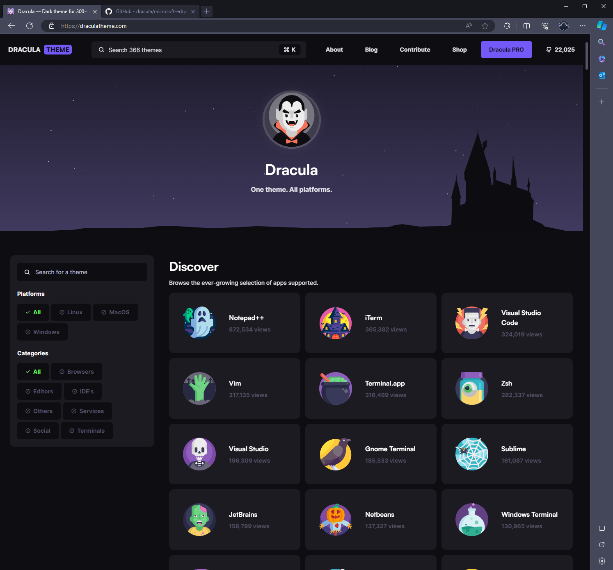

# Dracula for [Microsoft Edge]

> A dark theme for [Microsoft Edge].

## Install

All instructions can be found at [draculatheme.com/microsoft-edge](https://draculatheme.com/microsoft-edge).

## Team

This theme is maintained by the following person(s) and a bunch of [awesome contributors](https://github.com/dracula/microsoft-edge/graphs/contributors).

|      |
| ---------------------------------------------------------------------------------- |
| [ziroAU](https://github.com/ziroau)                                                |

## Community

- [Twitter](https://twitter.com/draculatheme) - Best for getting updates about themes and new stuff.
- [GitHub](https://github.com/dracula/dracula-theme/discussions) - Best for asking questions and discussing issues.
- [Discord](https://draculatheme.com/discord-invite) - Best for hanging out with the community.

## License

[MIT License](./LICENSE)

[Microsoft Edge]: https://www.microsoft.com/en-us/edge